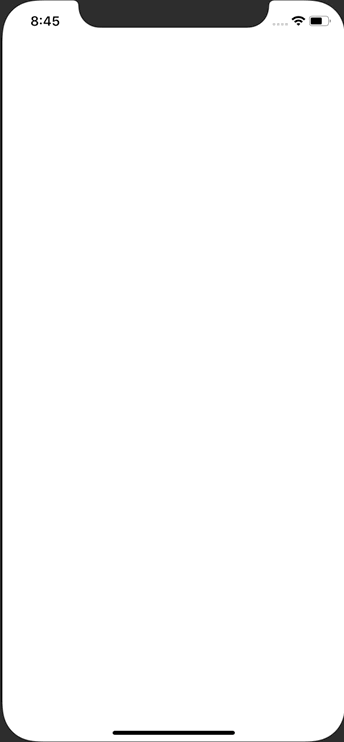

# circleAnimation

Progress circle animation in Swift using CoreAnimation and a Timer.

Custom View Controller creates a circle progress bar. In gif, 3 different views have the CircleVC added as a sublayer. CircleVC is parameterized to allow for customizations (animated or static, color, start percentage).

